# Estrutura de Grafos
Sávio Rodrigues
---
# Introdução
Atividade da diciplina de Algoritmo e Estrutura de Dados II tem como objetivo aplicar grafos com matriz de adjacência, matriz de incidência e busca de dados (BFS e DFS). Para tanto, utilizou-se como ponto de partida o código produzido durante as aulas sobre lista de Adjacências. A discussão proposta dessa documentação é apresentar a diferença de tais códigos e o seu custo referente ao tempo de execução e memória utilizada.
# Compilação
A compilação é realizada pelo compilador gcc com a seguinte linha de comando nas três representações de grafos:
    
	g++ Main.c -o Main

# Apresentação
A teoria dos grafos ( ramo da matemática que estuda as relações entre os objetos de um determinado conjunto) é um assunto antigo, porém com várias aplicações no nosso dia-a-dia. No século XVIII o matématico suiço Leonard Euler utilizou os grafos para resolver o problemas que conhecemos como __As Sete pontes de königsberg__. 
<br><br>
A imagem a seguir possui uma representação de grafo, onde os números representam os vértices (V = {0, 1, 2}) e as letras representam as arestas (A = {a, b ,c}).
<p align="center">
    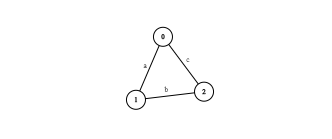
</p>
Nesse contexto existem três representações de grafos: Lista de Adjacencia, Matriz de Adjacência e Matriz de Incidência.
<br><br>

# Adaptações nas estruturas

## Matriz de Adjacência
Tendo como ponto de partida o código de lista de adjacência produzido durante as aulas, foram feitas algumas adaptações para que o algoritmo funcione como uma representação de matriz de Adjacência. A principal foi a substituição da variável `*adj` por `**adj`.

Em literatura a Matriz de adjacência é uma representação, com todas as arestas ou arcos de um grafo em uma matriz bidimencional _V x V_.
Portanto possui os seguintes atributos:
* ``int V`` = Número de vértices.
* ``int E`` = Número de Arestas.
* ``Vertex **adj`` = Matriz de Adjacência.
  
```c
typedef struct graph *Graph;
typedef struct TipoVertex *Vertex;

struct TipoVertex{
	int value;
};

struct graph{
	int V;
	int E;
	Vertex **adj;
};
```
A função ``GraphInitialize()`` precisou ser reajustada para atender a os objetivos da matriz de adjacência. Para tanto a função recebe como parâmetro o número de vértices e os inicializa em uma matriz a qual é preenchida com valor 0.
```c
Vertex VertexInitialize(int value){
	Vertex v = (Vertex )malloc (sizeof(Vertex));
	v->value = value;
	return v;
}

Graph GraphInitialize(int V){
	Graph G = (Graph)malloc (sizeof(Graph));
	G->V = V;
	G->E = 0;
	G->adj = (Vertex **)malloc(V * sizeof(Vertex));
	for(int i=0; i<V; i++)
		G->adj[i] = (Vertex *)malloc(sizeof(Vertex) * V);
	
	for(int i=0; i<V; i++)
		for(int j=0; j<V; j++)
			G->adj[i][j] = VertexInitialize(0);

	return G;
}
```
``GraphInsertEdge()`` tem a função de inserir na matriz as Arestas adicionadas atribuindo 1 relacionando vértices pela linha e coluna.

```C
void GraphInsertEdge(Graph G, int v1, int v2){
	if(G->adj[v1][v2]->value== 0){
		G->adj[v1][v2]->value=1;
		G->E++;
	}
}
```
Por fim a função ``ImprimeMatriz()`` e ``ImprimeGraph()``, mostra a matriz das relações dos vértices do grafo. Assim como mostra a imagem anexada ilustrando a compilação do grafo utilizado no slide 9/ aula 11.
```C
void ImprimeMatriz(Graph G){
	printf("\t --MATRIZ DE ADJACÊNCIA--\n");
	printf("\t   ");
	for(int i =0; i<G->V; i++)
		printf("[%d]",i);
	printf("\n");

	for(int i=0; i<G->V; i++){
		printf("\t[%d] ", i);
		for(int j = 0; j<G->V; j++)
			printf("%d  ", G->adj[i][j]->value);
		printf("\n");
	}
	printf("\n");
}

void ImprimeGraph(Graph G){
	printf("\t--VÉRTICES E ARESTAS--\n");

	for (int i=0; i< G->V; i++){
		printf("   [%d]->",i);
		for(int j=0; j< G->V; j++){
			if(G->adj[i][j]->value == 1)
				printf("%d ", j);
		}
		printf("\n");
	}
	printf("\n");
}
```
<p align="center">
    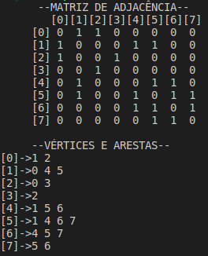
</p>

## Busca
### DFS
O algoritmo de busca DFS em matriz de adjacência se difere da lista de adjacência dentro da função `DFS_VISIT()`. O novo código percorre a linha da matriz procurando o valor 1.
```C
void DFS_VISIT(Graph G, int v, int *cor, int *d, int *f, int *tempo){
	cor[v]  = 1;
	*tempo  += 1;
	d[v]    = *tempo;

	for(int i = 0; i<G->V ; i++)
		if(G->adj[v][i]->value == 1 && cor[i] == 0)
			DFS_VISIT(G, i, cor, d, f, tempo);

	cor[v] = 2;
	*tempo += 1;
	f[v] = *tempo;
	printf("    Vertex:%d D:%d, F:%d \n", v, d[v], f[v]);
}
```
<p align="center">
    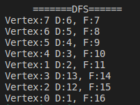
</p>

### BFS
O algoritmo de busca BFS em matriz de adjacência se difere da lista de adjacência dentro do ``while``. O novo código percorre a linha da matriz e enfileira o valor encontrado.
```C
while (f->size > 0){
	Item *u = Dequeue(f);
	for(int i =0; i< G->V; i++){
		if(G->adj[u->data][i]->value == 1 && cor[i]== 0){
			cor[i]= 1;
			d[i] = d[u->data] + 1;
			pi[i] = u->data;
			Queue(f, i);
		}
	}
	cor[u->data] = 2;
	printf("Vertex:%d\n", u->data);		
}
```
#### Compilação:
<p align="center">
    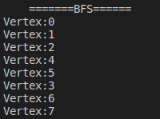
</p>
A compilação mostra que o algoritmo consegue chegar em todos os pontos pelo grafo teste apresentado.
<br></br>


## Matriz de Incidência
Semelhante à matriz de adjacência, a de incidência possui uma representação de grafo através de uma matriz bidimencional. Porém uma das dimensões são os vértices a outra são as arestas, ou seja uma matriz _V x E_. Portanto possui os seguintes atributos:
* ``int V`` = Número de vértices
* ``int A`` = Número de Arestas
* ``int **adj`` = Matriz de incidência.
  
```C
typedef struct TipoVertex *Vertex;
typedef struct graphInc *Graph;


struct TipoVertex{
	int value;
	Vertex prox;
};

struct graphInc{
	int V;
	int E;
	Vertex **adj;
};
```
A função ``GraphInitialize()`` recebe como parâmetro o número de vértices e o numero de arestas e os inicializa em uma matriz a qual é preenchida com valor 0.
```C
Vertex VertexInitialize(int value){
	Vertex v = (Vertex )malloc (sizeof(Vertex));
	v->value = value;
	return v;
}

Graph GraphInitialize(int V, int E){
	Graph G = (Graph)malloc (sizeof(Graph));
	G->V = V;
	G->E = 0;
	G->adj = (Vertex **)malloc(V * sizeof(Vertex));
	for(int i=0; i<V; i++)
		G->adj[i] = (Vertex *)malloc(sizeof(Vertex) * E);
	
	for(int i=0; i<V; i++)
		for(int j=0; j<E; j++)
			G->adj[i][j] = VertexInitialize(0);
	//printf("Grafo Criado!\n");
	return G;
}
```
Diferente da matriz de adjacência, a função ``GraphInsertEdge()`` na matriz de incidência tem a função de inserir 1 quando a aresta incide do vértice (representado pela linha) e -1 no vértice destino. Ou seja, em toda coluna da matriz, têm-se o valor 1 e -1 indicando o a incidência e destido de uma aresta.
```C
void GraphInsertEdge(Graph G, int v1, int v2){
	if(G->adj[v1][G->E]->value== 0){
		G->adj[v1][G->E]->value= 1;
		G->adj[v2][G->E]->value=-1;
		G->E++;
	}
}
```
Por fim a função ``ImprimeMatriz()`` mostra a matriz das relações dos vértices do grafo. Assim como mostra a imagem anexada em que foi utilizado o exemplo do slide 9/ aula 11 para a produção de uma parte desse documento.

```C
void ImprimeMatriz(Graph G){
	printf("\t\t\t\t --MATRIZ DE INCIDÊNCIA--\n");
	printf("\t   ");
	for(int i =0; i<G->E; i++)
		printf("[%2d]",i);
	printf("\n");

	for(int i=0; i<G->V; i++){
		printf("\t[%d] ", i);
		for(int j = 0; j<G->E; j++)
			printf("%2d  ", G->adj[i][j]->value);
		printf("\n");
	}
	printf("\n");
}
```
<p align="center">
    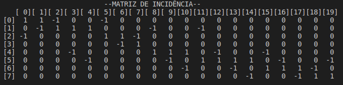
</p>
A compilação, mostra que foram criados 8 vértices e 20 arestas indicando a incidência e destino de cada uma na matriz.
<br></br>

## Busca
### DFS
O algoritmo de busca DFS em matriz de Incidência se difere das anteriores dentro da função `DFS_VISIT()`. O novo código percorre a linha da matriz procurando o valor 1, ou seja, das arestas que incidem do vértice analisado, e depois busca pelo valor -1.
```C
void DFS_VISIT(Graph G, int v, int *cor, int *d, int *f, int *tempo){
	cor[v]  = 1;
	*tempo  += 1;
	d[v]    = *tempo;

    for(int i = 0; i<G->E ; i++)
        if(G->adj[v][i]->value == 1)
            for(int j = 0; j<G->V; j++)
                if(G->adj[j][i]->value == 1 && cor[j] == 0)
                    DFS_VISIT(G, j, cor, d, f, tempo);

	cor[v] = 2;
	*tempo += 1;
	f[v] = *tempo;
	printf("    Vertex:%d D:%d, F:%d \n", v, d[v], f[v]);
}
```
#### Compilação:
<p align="center">
    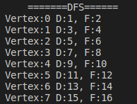
</p>

### BFS
A alteração na função se deu dentro do laço `while`. Diferente da estrutura BFS na matriz de adjacência, a de incidência necessita de dois laços de repetição. O primeiro laço busca o vértice de incidência através das arestas, representados por 1, e o outro busca o vértice de destino na mesma coluna, representado por -1 na matriz.
```C
while (f->size > 0){
		Item *u = Dequeue(f);

		for(int i =0; i< G->E; i++){
			if(G->adj[u->data][i]->value == 1)
                for(int v=0; v<G->V; ++v)    
                    if(G->adj[v][i]->value == -1 && cor[v] == 0){
                        cor[v]= 1;
                        d[v] = d[u->data] + 1;
                        pi[v] = u->data;
                        Queue(f, v);
			        }
		}

		cor[u->data] = 2;
		printf("    Vertex:%d\n", u->data);		
	}
```
#### Compilação:
<p align="center">
    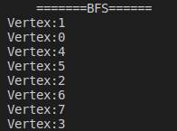
</p>

# Consumo de memória e tempo de execução

A atividade proposta tem como objetivo duas execuções dos grafos com 100 vértices para a obtenção de dados palpáveis na análise dos algoritmos. Um grafo esparso e um denso para cada uma das representações.

Os grafos esparsos foram executados com um total de 100 vértices (V) e 101 arestas (mesma ordem de V), cujo objetivo é garantir a não formação de subgrafos desconexos. Em adição, nos grafos densos, também com 100 vértices, foram adicionadas aproximadamente 10.000 (ordem V²) novas arestas aleatórias. 

Para coletar dados do consumo de memória ultilizado, usou-se o programa __valgrid__ com a opção `--leak-check=full` que compila o executável mostrando a quantidade de memória utilizada. O tempo de execução foi coletado a partir da biblioteca `time.h`. Por fim foram comentados as impressoes das matrizes para que não prejudique o resultado final da matriz de incidência que tem um número considerável de colunas. 
 

## Lista de Adjacência
### -Grafo Esparso
<p align="center">
    
	<br>
	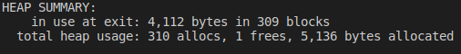
</p>

Segundo a saída do `Valgrind`, houveram `310` chamadas do malloc(), que trabalharam com um total de `5.136 bytes` de memória total.

### -Grafo Denso
<p align="center">
    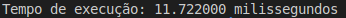
	<br>
	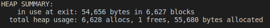
</p>

Segundo a saída do `Valgrind`, houveram `6.628` chamadas do malloc(), que trabalharam com um total de `55.680 bytes` de memória total.

## Matriz de Adjacência
### -Grafo Esparso
<p align="center">
    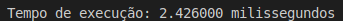
	<br>
	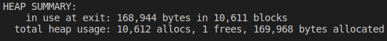
</p>

Segundo a saída do `Valgrind`, houveram `10.612` chamadas do malloc(), que trabalharam com um total de `169.968 bytes` de memória total.

### -Grafo Denso
<p align="center">
    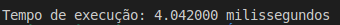
	<br>
	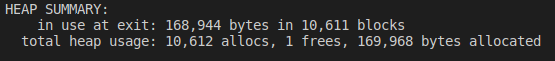
</p>

Segundo a saída do `Valgrind`, houveram `10.612` chamadas do malloc(), que trabalharam com um total de `169.968 bytes` de memória total.

## Matriz de Incidência
### -Grafo Esparso
<p align="center">
    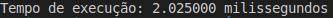
	<br>
	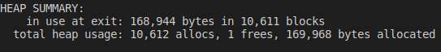
</p>

Segundo a saída do `Valgrind`, houveram `10.612` chamadas do malloc(), que trabalharam com um total de `169.968 bytes` de memória total.


### -Grafo Denso
<p align="center">
    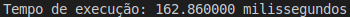
	<br>
	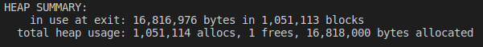
</p>

Segundo a saída do `Valgrind`, houveram `1.051.114` chamadas do malloc(), que trabalharam com um total de `16.818.000 bytes` de memória total.


## Conclusão
A fim de se produzir um Gráfico didático, os valores do consumo de memória e tempo da matriz de incidência foram divididos por 10.Portanto, a partir da coleta de dados , temos consumo de memória(Bytes) e tempo (milissegundos):

<p align="center">
    Consumo Memória
</p>
<p align="center">
    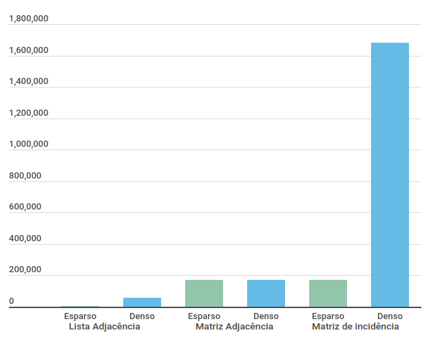
</p>
<p align="center">
    Tempo de Execução
</p>
<p align="center">
	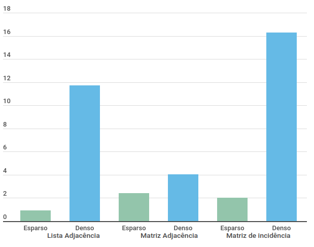
</p>
Diante dos resultados obtidos, a lista de adjacência possui a pior das representações em termos de consumo de memória e tempo de execução. No cenário custo a representação de Grafo que saiu melhor foi a lista de Adjacência, seguida da matriz de adjacência e por fim a matriz De Incidêcia que se torna inviável para uma grande quantidade de arestas.